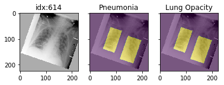

# torchxrayvision

A library for chest X-ray datasets and models. Including pre-trainined models.

([🎬 promo video about the project](https://www.youtube.com/watch?v=Rl7xz0uULGQ))

Motivation: While there are many publications focusing on the prediction of radiological and clinical findings from chest X-ray images much of this work is inaccessible to other researchers.

- In the case of researchers addressing clinical questions it is a waste of time for them to train models from scratch. To address this, TorchXRayVision provides pre-trained models which are trained on large cohorts of data and enables 1) rapid analysis of large datasets 2) feature reuse for few-shot learning.
- In the case of researchers developing algorithms it is import to robustly evaluate models using multiple external datasets. Metadata associated with each dataset can vary greatly which makes it difficult to apply methods to multiple datasets. TorchXRayVision provides access to many datasets in a uniform way so that they can be swapped out with a single line of code. These datasets can also be merged and filtered to construct specific distributional shifts for studying generalization.

This code is still under development

Twitter: [@torchxrayvision](https://twitter.com/torchxrayvision)

## Getting started

```
pip install torchxrayvision

import torchxrayvision as xrv
```

These are default pathologies:
```python3
xrv.datasets.default_pathologies 

['Atelectasis',
 'Consolidation',
 'Infiltration',
 'Pneumothorax',
 'Edema',
 'Emphysema',
 'Fibrosis',
 'Effusion',
 'Pneumonia',
 'Pleural_Thickening',
 'Cardiomegaly',
 'Nodule',
 'Mass',
 'Hernia',
 'Lung Lesion',
 'Fracture',
 'Lung Opacity',
 'Enlarged Cardiomediastinum']
```

## models ([demo notebook](https://github.com/mlmed/torchxrayvision/blob/master/scripts/xray_models.ipynb))

Specify weights for pretrained models (currently all DenseNet121)
Note: Each pretrained model has 18 outputs. The `all` model has every output trained. However, for the other weights some targets are not trained and will predict randomly becuase they do not exist in the training dataset. The only valid outputs are listed in the field `{dataset}.pathologies` on the dataset that corresponds to the weights. 

```python3
model = xrv.models.DenseNet(weights="all")
model = xrv.models.DenseNet(weights="kaggle") # RSNA Pneumonia Challenge
model = xrv.models.DenseNet(weights="nih") # NIH chest X-ray8
model = xrv.models.DenseNet(weights="pc") # PadChest (University of Alicante)
model = xrv.models.DenseNet(weights="chex") # CheXpert (Stanford)
model = xrv.models.DenseNet(weights="mimic_nb") # MIMIC-CXR (MIT)
model = xrv.models.DenseNet(weights="mimic_ch") # MIMIC-CXR (MIT)

model = xrv.baselinemodels.jfhealthcare.DenseNet() # DenseNet121 from JF Healthcare for the CheXpert competition

```

## autoencoders 
You can also load a pre-trained autoencoder that is trained on the PadChest, NIH, CheXpert, and MIMIC datasets.
```python3
ae = xrv.autoencoders.ResNetAE(weights="101-elastic")
z = ae.encode(image)
image2 = ae.decode(x)
```


## datasets ([demo notebook](https://github.com/mlmed/torchxrayvision/blob/master/scripts/xray_datasets.ipynb))
Only stats for PA/AP views are shown. Datasets may include more.

```python3
transform = torchvision.transforms.Compose([xrv.datasets.XRayCenterCrop(),
                                            xrv.datasets.XRayResizer(224)])

d_kaggle = xrv.datasets.RSNA_Pneumonia_Dataset(imgpath="path to stage_2_train_images_jpg",
                                       transform=transform)
                
d_chex = xrv.datasets.CheX_Dataset(imgpath="path to CheXpert-v1.0-small",
                                   csvpath="path to CheXpert-v1.0-small/train.csv",
                                   transform=transform)

d_nih = xrv.datasets.NIH_Dataset(imgpath="path to NIH images")

d_nih2 = xrv.datasets.NIH_Google_Dataset(imgpath="path to NIH images")

d_pc = xrv.datasets.PC_Dataset(imgpath="path to image folder")


d_covid19 = xrv.datasets.COVID19_Dataset() # specify imgpath and csvpath for the dataset
```

National Library of Medicine Tuberculosis Datasets [paper](https://www.ncbi.nlm.nih.gov/pmc/articles/PMC4256233/)

```python3
d_nlmtb = xrv.datasets.NLMTB_Dataset(imgpath="path to MontgomerySet or ChinaSet_AllFiles")

Using MontgomerySet data:
NLMTB_Dataset num_samples=138 views=['PA']
{'Tuberculosis': {0: 80, 1: 58}}
or using ChinaSet_AllFiles data:
NLMTB_Dataset num_samples=662 views=['PA', 'AP']
{'Tuberculosis': {0: 326, 1: 336}}

```

## dataset tools

relabel_dataset will align labels to have the same order as the pathologies argument.
```python3
xrv.datasets.relabel_dataset(xrv.datasets.default_pathologies , d_nih) # has side effects
```

specify a subset of views ([demo notebook](https://github.com/mlmed/torchxrayvision/blob/master/scripts/xray_datasets_views.ipynb))
```python3
d_kaggle = xrv.datasets.RSNA_Pneumonia_Dataset(imgpath="...",
                                               views=["PA","AP","AP Supine"])
```

specify only 1 image per patient
```python3
d_kaggle = xrv.datasets.RSNA_Pneumonia_Dataset(imgpath="...",
                                               unique_patients=True)
```

obtain summary statistics per dataset
```python3
d_chex = xrv.datasets.CheX_Dataset(imgpath="CheXpert-v1.0-small",
                                   csvpath="CheXpert-v1.0-small/train.csv",
                                 views=["PA","AP"], unique_patients=False)

CheX_Dataset num_samples=191010 views=['PA', 'AP']
{'Atelectasis': {0.0: 17621, 1.0: 29718},
 'Cardiomegaly': {0.0: 22645, 1.0: 23384},
 'Consolidation': {0.0: 30463, 1.0: 12982},
 'Edema': {0.0: 29449, 1.0: 49674},
 'Effusion': {0.0: 34376, 1.0: 76894},
 'Enlarged Cardiomediastinum': {0.0: 26527, 1.0: 9186},
 'Fracture': {0.0: 18111, 1.0: 7434},
 'Lung Lesion': {0.0: 17523, 1.0: 7040},
 'Lung Opacity': {0.0: 20165, 1.0: 94207},
 'Pleural Other': {0.0: 17166, 1.0: 2503},
 'Pneumonia': {0.0: 18105, 1.0: 4674},
 'Pneumothorax': {0.0: 54165, 1.0: 17693},
 'Support Devices': {0.0: 21757, 1.0: 99747}}
```

## Pathology masks ([demo notebook](https://github.com/mlmed/torchxrayvision/blob/master/scripts/xray_masks.ipynb))

```python3
d_rsna = xrv.datasets.RSNA_Pneumonia_Dataset(imgpath="stage_2_train_images_jpg", 
                                            views=["PA","AP"],
                                            pathology_masks=True)
d_rsna.csv.has_masks.value_counts()
False    20672
True      6012       

sample["pathology_masks"]
```


it also works with data_augmentation if you pass in `data_aug=data_transforms` to the dataloader. The random seed is matched to align calls for the image and the mask.



## Distribution shift tools ([demo notebook](https://github.com/mlmed/torchxrayvision/blob/master/scripts/xray_datasets-CovariateShift.ipynb))

The class `xrv.datasets.CovariateDataset` takes two datasets and two 
arrays representing the labels. The samples will be returned with the 
desired ratio of images from each site. The goal here is to simulate 
a covariate shift to make a model focus on an incorrect feature. Then 
the shift can be reversed in the validation data causing a catastrophic
failure in generalization performance.

ratio=0.0 means images from d1 will have a positive label
ratio=0.5 means images from d1 will have half of the positive labels
ratio=1.0 means images from d1 will have no positive label

With any ratio the number of samples returned will be the same.

```
d = xrv.datasets.CovariateDataset(d1 = # dataset1 with a specific condition
                                  d1_target = #target label to predict,
                                  d2 = # dataset2 with a specific condition
                                  d2_target = #target label to predict,
                                  mode="train", # train, valid, and test
                                  ratio=0.9)

```

## Citation

```
Joseph Paul Cohen, Joseph Viviano, Paul Morrison, Rupert Brooks, Mohammad Hashir, Hadrien Bertrand 
TorchXRayVision: A library of chest X-ray datasets and models. 
https://github.com/mlmed/torchxrayvision, 2020

@article{Cohen2020xrv,
author = {Cohen, Joseph Paul and Viviano, Joseph and Morrison, Paul and Brooks, Rupert and Hashir, Mohammad and Bertrand, Hadrien},
journal = {https://github.com/mlmed/torchxrayvision},
title = {{TorchXRayVision: A library of chest X-ray datasets and models}},
url = {https://github.com/mlmed/torchxrayvision},
year = {2020}
}


```
and this paper [https://arxiv.org/abs/2002.02497](https://arxiv.org/abs/2002.02497)
```
Joseph Paul Cohen and Mohammad Hashir and Rupert Brooks and Hadrien Bertrand
On the limits of cross-domain generalization in automated X-ray prediction. 
Medical Imaging with Deep Learning 2020 (Online: https://arxiv.org/abs/2002.02497)

@inproceedings{cohen2020limits,
  title={On the limits of cross-domain generalization in automated X-ray prediction},
  author={Cohen, Joseph Paul and Hashir, Mohammad and Brooks, Rupert and Bertrand, Hadrien},
  booktitle={Medical Imaging with Deep Learning},
  year={2020},
  url={https://arxiv.org/abs/2002.02497}
}
```
